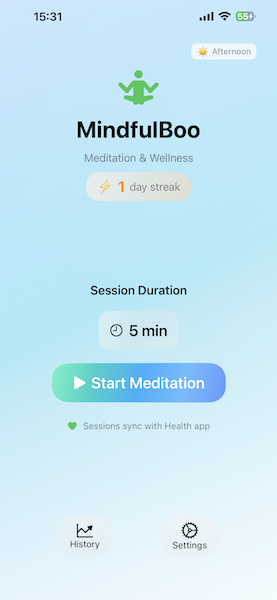

# 🧘‍♀️ MindfulBoo



A simple and fast meditation app for iOS.

## Features

- **Meditation Timer**: Customizable session durations with audio feedback
- **Smart Authorization**: Works even when iOS reports incorrect HealthKit permissions
- **Session History**: Detailed statistics, charts, and completion tracking
- **Health Integration**: Automatic syncing to Apple Health app
- **Session Management**: Individual and bulk session deletion with swipe gestures
- **Live UI Updates**: Real-time biometric display during meditation
- **Custom App Icon**: Beautiful, modern design

## What We've Built

- ✅ **Enhanced UI**: Permission status displays, refresh buttons, debug tools
- ✅ **Robust Permission Handling**: Tests actual data access beyond reported status
- ✅ **Session Analytics**: Charts, averages, and completion statistics
- ✅ **Data Management**: Delete individual sessions or all sessions with confirmation
- ✅ **Privacy-First**: No external APIs, all data stays on your device

## Requirements

- iOS 15.0+
- Xcode 14.0+

## Setup

1. Clone the repo
   ```bash
   git clone https://github.com/evangelosmeklis/mindfulboo.git
   ```
2. Open `mindfulboo.xcodeproj`
3. Select your development team
4. Build and run

## Testing Live Activities

Live Activities require a physical device running iOS 16.1 or later. The iOS simulator does not support them, so run the app on an actual device when testing the `MindfulBooWidget` live activity extension.

## Usage

1. **Start Session**: Set duration and tap "Start Meditation"
2. **Check History**: Detailed session analytics and health data charts
3. **Health Sync**: All sessions automatically save to Apple Health

## Technical Highlights

- **Smart HealthKit Integration**: Uses actual data access tests instead of unreliable iOS permission reports
- **Real-time Queries**: HKAnchoredObjectQuery for live biometric updates
- **Date Filtering**: Focuses on recent data (5 minutes) for accurate monitoring
- **Error Recovery**: Graceful handling of Watch connectivity and permission issues

## Privacy

See our [Privacy Policy](PRIVACY.md) for details on data collection and usage.

## License

GPL 3.0 